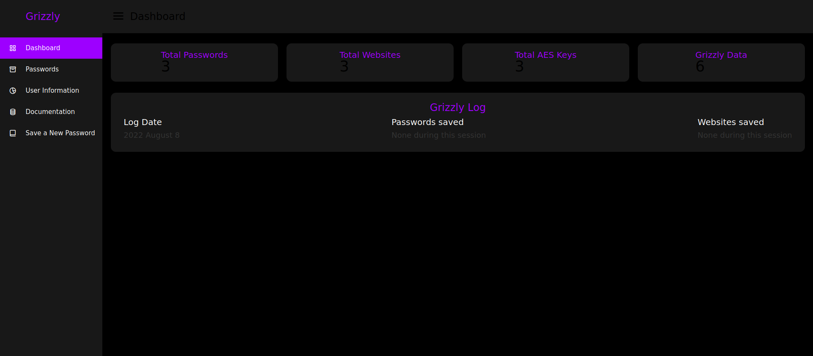
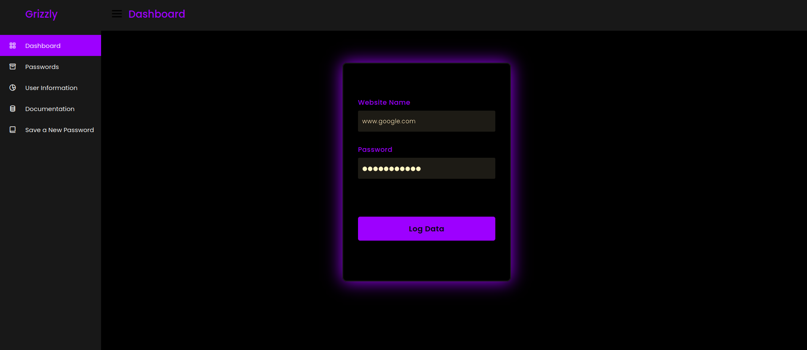
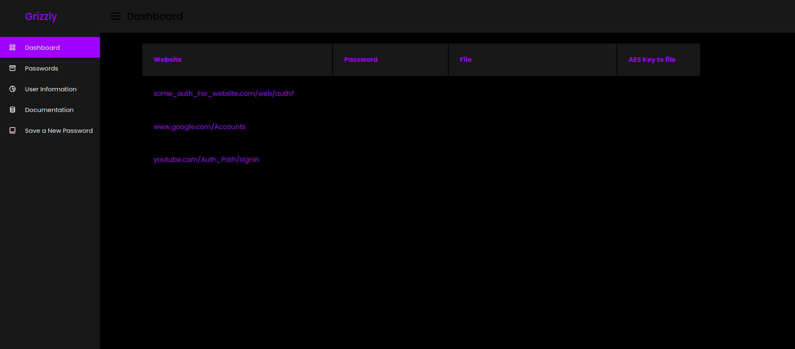

  

# What is it 

Grizzly is a beta program made to manage your everyday passwords, simple passwords are only supported at this time such as a website and a username. Grizzly impliments a few security features compared to others such as saving your passwords in randomly generated ID files encrypted using AES. The idea of grizzly is to keep hackers from seeing your passwords and not only brute forcing them but also managing to keep the live and decrypted data which is stored in an HTML file hidden and deleted. When you launch the grizzly password manager it will start a web interface on `127.0.0.1://5501`, once you save a password the password is stored in a text file, the text file is of random characters like so `ed@#^&@#^*EDF&*wsft.txt` and the password inside of the file is encrypted using AES, when you go to the passwords tab to view your saved passwords, an HTML template is auto generated, served, and instantly deleted. 

# Current issues and bugs with the project 

The idea of grizzly was to generate the random files, store the locations, and unlock the files in their remote location, this makes it harder for hackers to collect all passwords once your system is comprimised however this has not yet been implimented and is quite buggy, so files are stored in the grizzly filepath. The documentation part of the web interface DOES NOT WORK, it has not been writen yet so please make sure you do not submit a bug report when its simply just not finished. During large passwords like 32 character passwords the password will overflow the HTML and wont load properly.

> Web interface issues 

The web interface in the section user information is a bit bugged, it gives decent information but the pre generated CSS and html can mess up sometimes.

> Dashboard home grizzly log not showing up 

the grizzly log bar will show up but session stats will always default to `no passwords saved during this session` or `no websites saved during this session`

# Support for machines 

Currently grizzly is supported on the following browsers and machines 

| Operating System      | Browser name                 | 
| --------------------- | ---------------------------- |
| Windows 32/64 bit     | Firefox, Chrome, Brave       |
| MacOSx                | Firefox, Chrome, Brave       |
| Linux 32/64 bit       | Firefox, Chrome, Brave       |

# Project's future 

as the grizzly project progresses the security and features of the project will go on! and keep being open source, in the future the project will become closed source, this version beta and 1.0 will be free but the idea of this project was to be paid while also having community versions. Give the project support its super new and is only just now starting its journey

# User note 

Please do not give this project the shitty hand, it needs ALOT of improovement and was abandoned for quite some time, however i am also a developer with no team or contribs behind my hand, along with current things i am working on. This project will constantly be updated but keep in mind its barely even reached beta yet! 

# Demos 

### Dashboard home (http://localhost:5501) ###

### Save a new password ###

### User information ###

### View Saved Passwords ###

